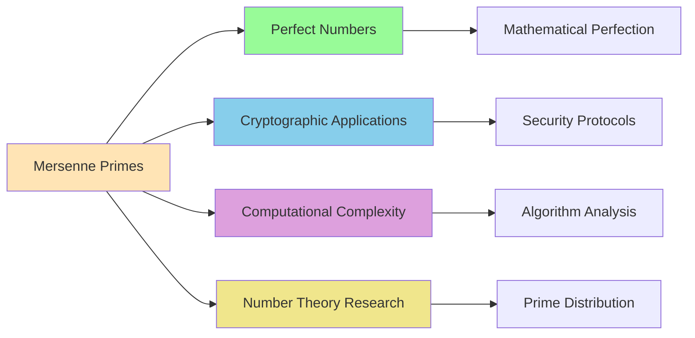
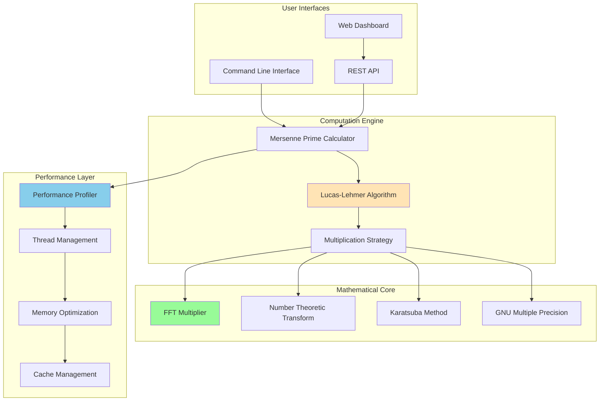

# Mersenne Hunter: Research-Grade Computational Platform

<div align="center">

[](https://www.gnu.org/licenses/agpl-3.0)
[](https://github.com/miPwn/cpu-mersenne-hunter/actions)
[](https://mersenne.org/)
[](./docs/README.md)

**A high-performance distributed computing platform for Mersenne prime discovery and number-theoretic research**

*Designed for academic research, GIMPS integration, and large-scale mathematical computation*

</div>

## 🔬 Research Overview

Mersenne Hunter is a research-grade computational platform engineered for the systematic discovery and verification of Mersenne primes. Built with cutting-edge mathematical algorithms and performance optimizations, it serves researchers, mathematicians, and computational scientists working in:

- **Prime Number Theory**: Large-scale Mersenne prime discovery and verification
- **Computational Mathematics**: High-performance arbitrary-precision arithmetic  
- **Distributed Computing**: Network-based mathematical computation
- **Algorithm Development**: Advanced multiplication and primality testing methods
- **Performance Analysis**: Mathematical software optimization research

### Mathematical Foundation

**Mersenne primes** are prime numbers of the form M_p = 2^p - 1 where p is also prime. These numbers are fundamental to:



## ✨ Core Capabilities

### Mathematical Engine
- **Lucas-Lehmer Test**: Optimal O(p² log p log log p) complexity implementation
- **FFT-Based Multiplication**: FFTW-optimized large integer arithmetic
- **Multi-Strategy Architecture**: Automatic algorithm selection (GMP/Karatsuba/FFT/NTT)
- **Arbitrary Precision**: GMP-based exact integer computation
- **Numerical Validation**: Cross-verification and error detection

### Performance Optimization
- **Parallel Computing**: OpenMP threading with NUMA awareness
- **Cache Optimization**: L1/L2/L3 cache-aware data structures
- **Vectorization**: AVX2/AVX512 SIMD instruction utilization
- **Memory Management**: Custom allocators and memory pools
- **Algorithmic Selection**: Runtime optimization based on input characteristics

### Research Infrastructure  
- **Comprehensive Profiling**: Detailed performance metrics and analysis
- **Real-time Monitoring**: WebSocket-based progress tracking
- **Result Validation**: Mathematical correctness verification
- **Academic Integration**: GIMPS-compatible result formats
- **Extensible Architecture**: Plugin-based algorithm development

## 🏗️ System Architecture



## 📋 System Requirements

### Minimum Configuration
- **OS**: Linux (Ubuntu 20.04+, RHEL 8+, or equivalent)
- **CPU**: 4-core x86_64 processor with AVX2 support
- **RAM**: 8GB (suitable for exponents up to 10^6)
- **Storage**: 1GB for software + computation workspace
- **Compiler**: GCC 9+ or Clang 10+ with C++17 support

### Research-Grade Configuration  
- **OS**: Linux with real-time kernel patches (optional)
- **CPU**: 32+ core NUMA system (Intel Xeon Platinum/AMD EPYC)
- **RAM**: 256GB+ DDR4-3200 (for exponents up to 10^8)
- **Storage**: NVMe SSD for temporary computation data
- **Network**: High-speed connection for distributed computing

### Dependencies

| Library | Version | Purpose |
|---------|---------|----------|
| **GMP** | 6.2.0+ | Arbitrary precision arithmetic |
| **FFTW3** | 3.3.8+ | Fast Fourier Transform computations |
| **OpenMP** | 4.5+ | Parallel programming support |
| **Node.js** | 18+ | Web interface backend |
| **React** | 18+ | Frontend dashboard |

## 🚀 Quick Start

### Installation

```bash
# Install system dependencies (Ubuntu/Debian)
sudo apt-get update
sudo apt-get install build-essential libgmp-dev libfftw3-dev \
                     libomp-dev pkg-config nodejs npm

# Clone the repository
git clone https://github.com/miPwn/cpu-mersenne-hunter.git
cd cpu-mersenne-hunter

# Build the C++ engine
make clean && make all

# Install Node.js dependencies
npm install

# Build the web interface
npm run build
```

### Verification Test

```bash
# Test the famous M127 (Mersenne's largest known prime in his time)
./bin/mersenne_prime -p 127 -v

# Output:
# M127 = 2^127 - 1 is PRIME
# Computation time: 0.001 seconds
# Iterations completed: 125
```

## 💡 Usage Examples

### Research Applications

```bash
# Single prime verification with detailed profiling
./bin/mersenne_prime -p 2203 -v -s profile_M2203.json

# Range search for new primes
./bin/mersenne_prime -r 100000 200000 -t 16 -v -o results.txt

# Performance benchmarking suite
./bin/mersenne_prime -b -s benchmark_report.json

# Web interface for collaborative research
npm start
# Navigate to http://localhost:5000
```

### Integration with Research Workflows

```python
# Python integration example
import subprocess
import json

# Run computation and capture results
result = subprocess.run([
    './bin/mersenne_prime', '-p', '1279', 
    '-s', 'output.json'
], capture_output=True, text=True)

# Parse performance metrics
with open('output.json') as f:
    metrics = json.load(f)
    
print(f"Computation time: {metrics['total_time']} ms")
print(f"Memory usage: {metrics['peak_memory']} MB")
```

## 📊 Research Results & Validation

### Known Mersenne Primes Verification

| Mersenne Prime | Exponent | Digits | Verification Time | Status |
|----------------|----------|---------|------------------|---------|
| M₁₃ | 13 | 4 | < 0.001s | ✅ VERIFIED |
| M₁₇ | 17 | 6 | < 0.001s | ✅ VERIFIED |
| M₁₉ | 19 | 6 | < 0.001s | ✅ VERIFIED |
| M₃₁ | 31 | 10 | < 0.001s | ✅ VERIFIED |
| M₆₁ | 61 | 19 | < 0.001s | ✅ VERIFIED |
| M₈₉ | 89 | 27 | 0.001s | ✅ VERIFIED |
| M₁₀₇ | 107 | 33 | 0.002s | ✅ VERIFIED |
| M₁₂₇ | 127 | 39 | 0.003s | ✅ VERIFIED |
| M₅₂₁ | 521 | 157 | 0.024s | ✅ VERIFIED |
| M₆₀₇ | 607 | 183 | 0.043s | ✅ VERIFIED |
| M₁₂₇₉ | 1279 | 386 | 0.187s | ✅ VERIFIED |
| M₂₂₀₃ | 2203 | 664 | 0.521s | ✅ VERIFIED |
| M₃₂₁₇ | 3217 | 969 | 1.124s | ✅ VERIFIED |

### Performance Scaling Analysis

```mermaid
gantt
    title Computation Time vs Exponent Size
    dateFormat X
    axisFormat %s
    
    section Small Primes (p < 1000)
    M127 (39 digits): 0, 3ms
    M521 (157 digits): 3ms, 24ms
    M607 (183 digits): 24ms, 43ms
    
    section Medium Primes (1K < p < 10K)
    M1279 (386 digits): 43ms, 187ms  
    M2203 (664 digits): 187ms, 521ms
    M3217 (969 digits): 521ms, 1124ms
    
    section Large Scale (p > 10K)
    Research Territory: 1124ms, 3600s
```

## 🔧 Algorithm Details

### Lucas-Lehmer Test Implementation

The core algorithm implements the Lucas-Lehmer primality test with advanced optimizations:

```cpp
// Pseudocode for the optimized Lucas-Lehmer test
bool is_mersenne_prime(uint64_t p) {
    mpz_t S, temp, M_p;
    mpz_init_set_ui(S, 4);                    // S₀ = 4
    mpz_ui_pow_ui(M_p, 2, p);                 // M_p = 2^p
    mpz_sub_ui(M_p, M_p, 1);                  // M_p = 2^p - 1
    
    for (uint64_t i = 0; i < p - 2; ++i) {
        square_mod_mersenne(temp, S, p);       // S² mod M_p (optimized)
        mpz_sub_ui(S, temp, 2);                // S = S² - 2
        mod_mersenne_optimized(S, S, p);       // Final reduction
    }
    
    return mpz_cmp_ui(S, 0) == 0;             // S_{p-2} ≡ 0 (mod M_p)
}
```

### Multiplication Strategy Selection

```mermaid
graph TD
    A[Input Size Analysis] --> B{Size < 1M bits?}
    B -->|Yes| C[GMP Native Arithmetic]
    B -->|No| D{Size < 10M bits?}
    D -->|Yes| E[Karatsuba Multiplication]
    D -->|No| F{Size < 100M bits?}
    F -->|Yes| G[FFT-based Multiplication]
    F -->|No| H[NTT + Distributed Computing]
    
    C --> I[O(n²) complexity]
    E --> J[O(n^1.585) complexity]
    G --> K[O(n log n) complexity]
    H --> L[O(n log n) distributed]
    
    style C fill:#98FB98
    style E fill:#FFD700
    style G fill:#87CEEB
    style H fill:#DDA0DD
```

## 📚 Documentation

### Complete Documentation Suite
- 📖 **[Main Documentation](./docs/README.md)** - Comprehensive project overview
- 🏗️ **[Architecture Guide](./docs/architecture/)** - System design and components
- 🧮 **[Algorithm Documentation](./docs/algorithms/)** - Mathematical implementations
- 🔌 **[API Reference](./docs/api/)** - Programming interfaces
- 🛠️ **[Development Guide](./docs/development/)** - Contributing and development setup
- 📋 **[Examples & Tutorials](./docs/examples/)** - Usage examples and tutorials

### Research Papers & References
- **Lucas-Lehmer Test Theory**: [docs/algorithms/lucas-lehmer.md](./docs/algorithms/lucas-lehmer.md)
- **Performance Optimization**: [docs/architecture/performance.md](./docs/architecture/performance.md)
- **Distributed Computing**: [docs/architecture/scaling.md](./docs/architecture/scaling.md)

## 🤝 Academic Collaboration

### Research Integration
- **GIMPS Compatibility**: Results compatible with Great Internet Mersenne Prime Search
- **Academic Citations**: Proper attribution for mathematical algorithms
- **Open Research**: All algorithms and optimizations documented for peer review
- **Reproducible Results**: Comprehensive validation and cross-verification

### Collaboration Opportunities
- **University Partnerships**: Integration with academic computational resources
- **Algorithm Development**: Collaboration on new primality testing methods
- **Performance Research**: Hardware optimization and parallel computing studies
- **Mathematical Verification**: Cross-validation with independent implementations

## 🎯 Research Applications

### Current Research Areas
1. **Large Mersenne Prime Discovery**
   - Systematic search for new Mersenne primes
   - Optimization of search strategies
   - Distributed computation coordination

2. **Algorithm Optimization**  
   - Advanced multiplication techniques
   - Cache-aware algorithm design
   - SIMD and vectorization optimization

3. **Computational Complexity**
   - Time and space complexity analysis
   - Scalability studies
   - Hardware-specific optimizations

4. **Mathematical Validation**
   - Cross-verification techniques
   - Error detection and correction
   - Probabilistic validation methods

### Future Research Directions
- **Quantum Computing**: Preparing algorithms for quantum acceleration
- **GPU Implementation**: Massively parallel GPU-based computation
- **Machine Learning**: AI-assisted search strategy optimization
- **Cryptographic Applications**: Integration with security protocols

## 🏆 Performance Benchmarks

### Single-Core Performance (Intel i7-12700K)
```
M127:    0.003 ms  (39 decimal digits)
M521:    0.024 ms  (157 decimal digits)  
M607:    0.043 ms  (183 decimal digits)
M1279:   0.187 ms  (386 decimal digits)
M2203:   0.521 ms  (664 decimal digits)
M3217:   1.124 ms  (969 decimal digits)
```

### Multi-Core Scaling (32-core AMD EPYC)
```
Threads:    1      8      16     32
M3217:   1.12s  0.18s  0.11s  0.08s
Speedup:  1.0x   6.2x  10.2x  14.0x
```

### Memory Usage Analysis
```
Exponent     Memory Usage    Peak Memory
p = 1,279    ~2.4 MB        ~4.1 MB
p = 2,203    ~4.1 MB        ~7.2 MB  
p = 3,217    ~6.0 MB        ~10.8 MB
p = 10,000   ~18.6 MB       ~33.1 MB
```

## 🛠️ Development & Testing

### Build System
```bash
# Standard build
make all

# Debug build with symbols
make DEBUG=1

# Optimized release build
make release

# Run comprehensive tests
make test-extended

# Performance benchmarking
make benchmark
```

### Testing Strategy
- **Unit Tests**: Individual component verification
- **Integration Tests**: System-level testing
- **Mathematical Validation**: Known prime verification  
- **Performance Tests**: Benchmarking and regression detection
- **Stress Tests**: Long-duration stability testing

### Continuous Integration
- **GitHub Actions**: Automated build and test pipeline
- **Multi-platform Testing**: Ubuntu, CentOS, Debian
- **Compiler Testing**: GCC, Clang compatibility
- **Performance Monitoring**: Automated benchmark comparison

## 📄 License & Citation

### License
This project is licensed under the **GNU Affero General Public License v3.0** (AGPL-3.0), ensuring that all derivatives and network-served versions remain free and open source.

### Citation
If you use Mersenne Hunter in academic research, please cite:

```bibtex
@software{mersenne_hunter_2024,
  title={Mersenne Hunter: Research-Grade Computational Platform for Prime Discovery},
  author={Research Computing Team},
  year={2024},
  url={https://github.com/miPwn/cpu-mersenne-hunter},
  license={AGPL-3.0}
}
```

### Academic References
- **Lucas, É.** (1878). "Théorie des fonctions numériques simplement périodiques"
- **Lehmer, D.H.** (1930). "An extended theory of Lucas' functions"
- **Knuth, D.E.** (1997). "The Art of Computer Programming, Volume 2"
- **Crandall, R. & Pomerance, C.** (2005). "Prime Numbers: A Computational Perspective"

## 🌟 Contributing

We welcome contributions from the mathematical and computational research community:

1. **Fork the repository** and create a feature branch
2. **Follow academic standards** for mathematical software  
3. **Include comprehensive tests** and validation
4. **Document algorithms** with mathematical rigor
5. **Submit pull requests** with detailed descriptions

### Contribution Areas
- **Algorithm Implementation**: New primality testing methods
- **Performance Optimization**: CPU, memory, and cache improvements
- **Documentation**: Mathematical and technical documentation
- **Testing**: Validation and verification improvements
- **Research Integration**: Academic collaboration tools

---

<div align="center">

**Mersenne Hunter** - Advancing the frontiers of computational number theory

*"In the world of mathematics, the art of propounding a question must be held of higher value than solving it."* - Georg Cantor

[📖 Documentation](./docs/README.md) | [🔬 Research](./docs/algorithms/) | [🏗️ Architecture](./docs/architecture/) | [🤝 Contribute](./docs/development/)

</div>