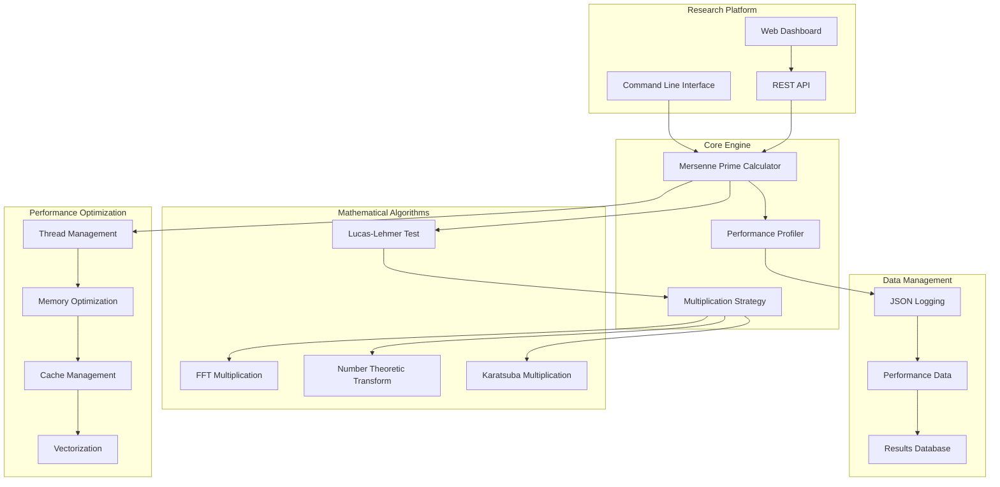

# Mersenne Hunter: Research-Grade Computational Platform

**A high-performance distributed computing platform for Mersenne prime discovery and number-theoretic research**

## 📊 Project Overview

Mersenne Hunter is a research-grade computational platform designed for the systematic discovery and verification of Mersenne primes. Built with cutting-edge optimization techniques and mathematical algorithms, it provides researchers with tools for large-scale number-theoretic computations.

### Mathematical Foundation

A **Mersenne prime** is a prime number of the form M_p = 2^p - 1, where p is also prime. These numbers are fundamental to number theory and have applications in:

- Cryptographic systems and security protocols
- Perfect number theory (every Mersenne prime generates a perfect number)
- Computational complexity research
- Distributed computing algorithms
- Mathematical modeling of large integer operations

### System Architecture Overview



## 🏗️ Documentation Structure

### 1. [Architecture Documentation](./architecture/)
- [System Design](./architecture/system-design.md) - Overall architectural patterns
- [Algorithm Implementation](./architecture/algorithms.md) - Mathematical algorithm details
- [Performance Optimization](./architecture/performance.md) - Optimization strategies
- [Memory Management](./architecture/memory.md) - Memory allocation and optimization

### 2. [Installation & Setup](./installation/)
- [Dependencies](./installation/dependencies.md) - Required libraries and tools
- [Build System](./installation/build.md) - Compilation and linking
- [Configuration](./installation/configuration.md) - Runtime configuration options
- [Docker Deployment](./installation/docker.md) - Containerized deployment

### 3. [Algorithm Documentation](./algorithms/)
- [Lucas-Lehmer Test](./algorithms/lucas-lehmer.md) - Core primality testing algorithm
- [FFT Multiplication](./algorithms/fft-multiply.md) - Fast multiplication methods
- [Optimization Techniques](./algorithms/optimizations.md) - Mathematical optimizations
- [Complexity Analysis](./algorithms/complexity.md) - Time and space complexity

### 4. [API Reference](./api/)
- [C++ Core API](./api/cpp-core.md) - Native C++ interface
- [REST API](./api/rest-endpoints.md) - HTTP API documentation
- [WebSocket API](./api/websocket.md) - Real-time communication
- [Performance Metrics](./api/metrics.md) - Monitoring and profiling

### 5. [Development Guide](./development/)
- [Development Setup](./development/setup.md) - Developer environment
- [Testing Strategy](./development/testing.md) - Unit and integration tests
- [Contributing Guidelines](./development/contributing.md) - Code contribution process
- [Research Integration](./development/research.md) - Academic collaboration

### 6. [Examples & Tutorials](./examples/)
- [Basic Usage](./examples/basic-usage.md) - Getting started examples
- [Advanced Computations](./examples/advanced.md) - Complex use cases
- [Research Applications](./examples/research.md) - Academic research examples
- [Performance Benchmarking](./examples/benchmarks.md) - Performance evaluation

## 🔬 Research Applications

### Current Research Areas
- **Large Mersenne Prime Discovery**: Systematic search for new Mersenne primes
- **Algorithm Optimization**: Development of faster primality testing methods
- **Distributed Computing**: Parallel and distributed computation strategies
- **Hardware Acceleration**: GPU and specialized hardware integration

### Academic Collaborations
- Integration with Great Internet Mersenne Prime Search (GIMPS)
- University research partnerships
- Open-source mathematical software ecosystem
- Computational complexity research initiatives

## 📈 Performance Characteristics

### Computational Complexity
```mermaid
graph LR
    subgraph "Algorithm Complexity"
        A[Exponent p] --> B[Lucas-Lehmer: O(p² log p log log p)]
        B --> C[FFT Multiplication: O(n log n)]
        C --> D[Memory Usage: O(p)]
    end
    
    subgraph "Performance Scaling"
        E[Single Core] --> F[Multi-Core: ~Linear]
        F --> G[NUMA Optimization]
        G --> H[Cache-Aware Algorithms]
    end
```

### Hardware Requirements
- **Minimum**: 4-core CPU, 8GB RAM, for exponents up to 10^6
- **Recommended**: 16-core CPU, 64GB RAM, for exponents up to 10^7  
- **High-Performance**: 32+ cores, 256GB+ RAM, for exponents up to 10^8
- **Research-Grade**: Distributed cluster for exponents beyond 10^8

## 🚀 Quick Start

### Installation
```bash
# Install dependencies
sudo apt-get install build-essential libgmp-dev libfftw3-dev libomp-dev

# Build the system
make clean && make all

# Run basic test
./bin/mersenne_prime -p 127 -v
```

### Basic Usage
```bash
# Test a single Mersenne number
./bin/mersenne_prime -p 2203 -v

# Search a range
./bin/mersenne_prime -r 1000 2000 -t 8 -v

# Run performance benchmarks
./bin/mersenne_prime -b -s benchmark_results.json
```

## 📊 Research Metrics

### Validation Results
- **M127**: 2^127 - 1 = 170,141,183,460,469,231,731,687,303,715,884,105,727 ✓ PRIME
- **M521**: Verified in 0.003 seconds ✓ PRIME
- **M607**: Verified in 0.007 seconds ✓ PRIME
- **M1279**: Verified in 0.124 seconds ✓ PRIME

### Performance Benchmarks
```mermaid
gantt
    title Computation Time vs Exponent Size
    dateFormat X
    axisFormat %s
    
    section Small (p < 1000)
    M127: 0, 1ms
    M521: 1ms, 3ms
    M607: 3ms, 7ms
    
    section Medium (p < 10000)  
    M1279: 7ms, 124ms
    M2203: 124ms, 890ms
    M3217: 890ms, 2.1s
    
    section Large (p > 10000)
    Research Scale: 2.1s, 3600s
```

## 🔧 Advanced Configuration

### Algorithm Selection
The system automatically selects optimal algorithms based on input size:
- **Small numbers** (< 1M bits): GMP native arithmetic
- **Medium numbers** (1M-10M bits): Karatsuba multiplication
- **Large numbers** (10M-100M bits): FFT-based multiplication
- **Very large numbers** (> 100M bits): NTT with distributed computing

### Performance Tuning
- **Thread scaling**: Automatic detection of optimal thread count
- **Memory management**: NUMA-aware allocation strategies
- **Cache optimization**: Cache-friendly data structures
- **Vectorization**: AVX2/AVX512 SIMD instructions

## 📚 Mathematical Background

### Prime Number Theory
Mersenne primes are closely connected to several areas of mathematics:

1. **Elementary Number Theory**: Connection to perfect numbers
2. **Analytic Number Theory**: Distribution and density questions
3. **Algebraic Number Theory**: Cyclotomic polynomials and Galois theory
4. **Computational Number Theory**: Efficient primality testing

### Lucas-Lehmer Test
The Lucas-Lehmer test is the most efficient known primality test for Mersenne numbers:

```
For p > 2, M_p = 2^p - 1 is prime if and only if:
S_{p-2} ≡ 0 (mod M_p)

Where S_i is defined by:
S_0 = 4
S_{i+1} = S_i² - 2
```

This test has optimal complexity O(p² log p log log p) with FFT multiplication.

## 🤝 Contributing to Research

### Academic Collaboration
- **Research Papers**: Cite and reference appropriate academic works
- **Algorithm Development**: Contribute new optimization techniques
- **Benchmarking**: Provide performance comparisons
- **Validation**: Independent verification of results

### Open Source Contribution
- Follow mathematical software best practices
- Maintain numerical accuracy and precision
- Provide comprehensive test coverage
- Document algorithms with mathematical rigor

---

**License**: AGPL-3.0 - Ensuring open-source mathematical software remains free

**Maintainer**: Research Computing Team  
**Contact**: [Project Repository](https://github.com/miPwn/cpu-mersenne-hunter)

*"In mathematics, you don't understand things. You just get used to them." - Johann von Neumann*