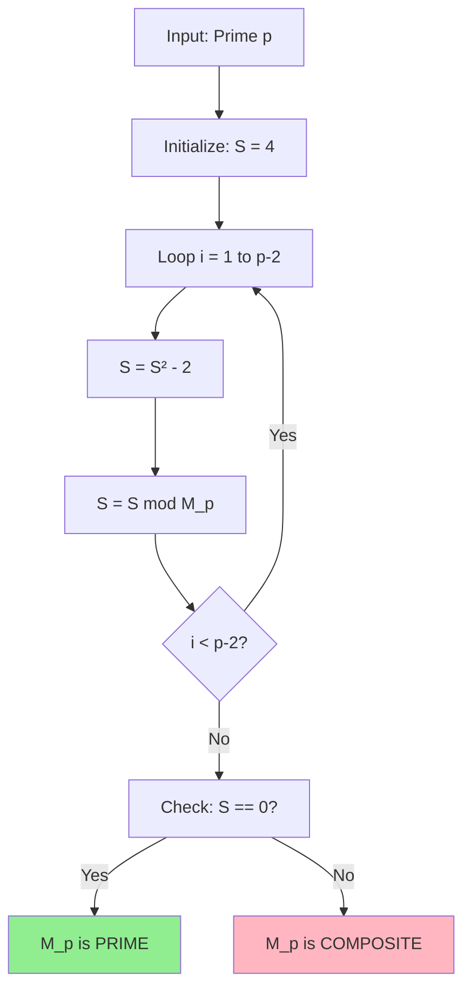
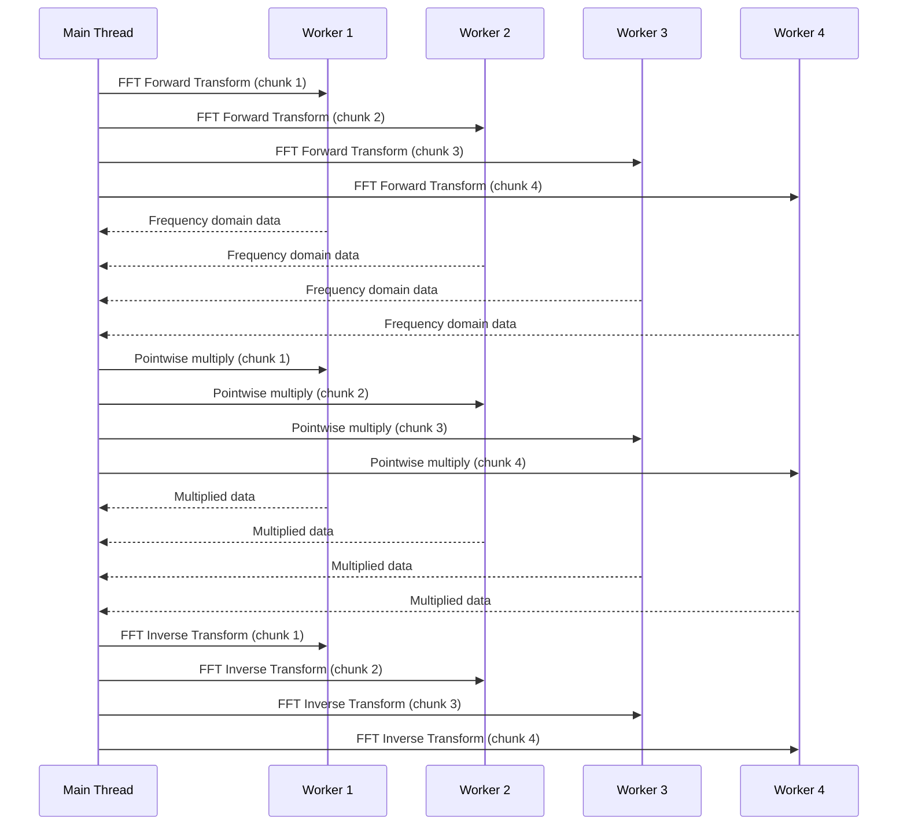
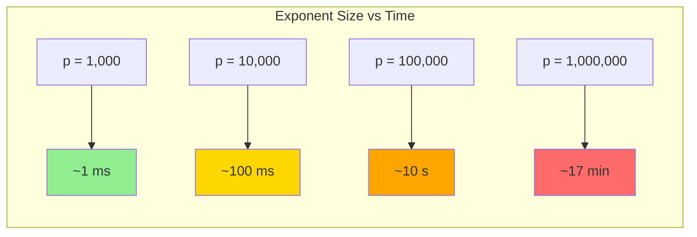

# Lucas-Lehmer Primality Test

## Mathematical Foundation

The Lucas-Lehmer test is the most efficient known primality test specifically designed for Mersenne numbers of the form M_p = 2^p - 1 where p is an odd prime.

### Theorem (Lucas-Lehmer)
For an odd prime p ≥ 3, the Mersenne number M_p = 2^p - 1 is prime if and only if M_p divides S_{p-2}, where the sequence S_i is defined by:

```
S_0 = 4
S_{i+1} = S_i² - 2 (mod M_p) for i ≥ 0
```

### Mathematical Proof Outline

The proof relies on the theory of Lucas sequences and quadratic residues. The key insight is that the sequence S_i is related to the Lucas sequence with parameters P = 4, Q = 2.

**Key Properties:**
1. S_i = α^(2^i) + β^(2^i), where α = 2 + √3 and β = 2 - √3
2. α·β = 1, so β = α^(-1)
3. The test exploits the multiplicative order of α modulo M_p

## Algorithm Implementation

### Core Algorithm Flow



### Optimized Modular Arithmetic

The modular reduction S mod M_p can be optimized using the special form of Mersenne numbers:

For M_p = 2^p - 1, if we have a number N with binary representation:
```
N = a_{2p-2}2^{2p-2} + ... + a_p2^p + a_{p-1}2^{p-1} + ... + a_12^1 + a_0
```

Then N mod M_p can be computed as:
```
N mod M_p = (a_{2p-2}2^{2p-2-p} + ... + a_p2^{p-p} + a_{p-1}2^{p-1} + ... + a_0) mod M_p
         = (a_{2p-2}2^{p-2} + ... + a_p + a_{p-1}2^{p-1} + ... + a_0) mod M_p
```

### C++ Implementation Details

```cpp
bool MersennePrime::lucas_lehmer_sequential(uint64_t exponent) {
    // Initialize S = 4
    mpz_t S, temp, mersenne;
    mpz_inits(S, temp, mersenne, nullptr);
    
    // Compute M_p = 2^p - 1
    mpz_ui_pow_ui(mersenne, 2, exponent);
    mpz_sub_ui(mersenne, mersenne, 1);
    
    mpz_set_ui(S, 4);
    
    // Main Lucas-Lehmer iteration: S_{i+1} = S_i^2 - 2 (mod M_p)
    for (uint64_t i = 0; i < exponent - 2; ++i) {
        square_mod_mersenne(temp, S, exponent);
        mpz_sub_ui(S, temp, 2);
        
        // Optimized modular reduction for Mersenne numbers
        mod_mersenne_optimized(S, S, exponent);
        
        ++iterations_completed;
    }
    
    bool is_prime = (mpz_cmp_ui(S, 0) == 0);
    
    mpz_clears(S, temp, mersenne, nullptr);
    return is_prime;
}
```

## Performance Optimizations

### 1. Specialized Mersenne Modular Reduction

```mermaid
graph LR
    A[Input: N bits] --> B[Split at position p]
    B --> C[High bits: N >> p]
    C --> D[Low bits: N & ((1 << p) - 1)]
    D --> E[Result: High + Low]
    E --> F{Result >= M_p?}
    F -->|Yes| G[Subtract M_p]
    F -->|No| H[Return Result]
    G --> H
```

### 2. FFT-based Squaring

For large exponents, the bottleneck is computing S² mod M_p. We use FFT-based multiplication:

```cpp
void MersennePrime::square_mod_mersenne(mpz_t result, const mpz_t value, uint64_t exponent) {
    if (mpz_sizeinbase(value, 2) > FFT_THRESHOLD) {
        // Use FFT for large numbers
        fft_multiplier.square_and_mod_mersenne(result, value, exponent);
        ++fft_operations;
    } else {
        // Use GMP's optimized squaring for smaller numbers
        mpz_mul(result, value, value);
        mod_mersenne_optimized(result, result, exponent);
    }
}
```

### 3. Thread-Level Parallelization

For very large exponents, we can parallelize individual squaring operations:



## Complexity Analysis

### Time Complexity

| Operation | Complexity | Notes |
|-----------|------------|--------|
| Naive Lucas-Lehmer | O(p³) | Using naive multiplication |
| Karatsuba-based | O(p^2.585) | Karatsuba multiplication |
| FFT-based | **O(p² log p log log p)** | Optimal for large p |
| NTT-based | O(p² log p) | Theoretical improvement |

### Space Complexity

| Component | Memory Usage | Scaling |
|-----------|--------------|---------|
| Mersenne number M_p | p bits | O(p) |
| Lucas-Lehmer sequence S_i | ≤ p bits | O(p) |
| FFT working space | 2p bits | O(p) |
| **Total** | **~4p bits** | **O(p)** |

### Performance Scaling



## Specialized Optimizations

### Small Exponents (p < 10^6)

For small exponents, GMP's native arithmetic is often faster than FFT:

```cpp
namespace MersenneOptimizations {
    bool fast_lucas_lehmer_small(uint64_t exponent) {
        // Use GMP's highly optimized mpz_mul
        // with custom Mersenne modular reduction
        return standard_lucas_lehmer_with_gmp(exponent);
    }
}
```

### Medium Exponents (10^6 ≤ p < 10^7)

Use Karatsuba multiplication with optimized thresholds:

```cpp
namespace MersenneOptimizations {
    bool fast_lucas_lehmer_medium(uint64_t exponent) {
        // Configure Karatsuba threshold based on cache size
        size_t threshold = get_optimal_karatsuba_threshold();
        return karatsuba_lucas_lehmer(exponent, threshold);
    }
}
```

### Large Exponents (p ≥ 10^7)

Full FFT multiplication with thread-level parallelization:

```cpp
namespace MersenneOptimizations {
    bool fast_lucas_lehmer_large(uint64_t exponent, int num_threads) {
        // Use FFTW with OpenMP threading
        return parallel_fft_lucas_lehmer(exponent, num_threads);
    }
}
```

## Numerical Stability and Error Analysis

### Floating-Point Precision Requirements

When using FFT-based multiplication, we must ensure sufficient precision:

- **Double precision** (53 bits): Suitable for exponents up to ~10^6
- **Extended precision** (64+ bits): Required for exponents up to ~10^7
- **Arbitrary precision**: Necessary for research-scale computations

### Error Propagation Analysis

```mermaid
graph TD
    A[Floating-Point Error ε] --> B[Multiplication Error: 2ε]
    B --> C[Accumulation over p-2 iterations]
    C --> D[Total Error: O(p·ε)]
    D --> E{Error < 0.5?}
    E -->|Yes| F[Correct Result]
    E -->|No| G[Precision Loss]
    
    style F fill:#90EE90
    style G fill:#FFB6C1
```

### Validation Techniques

1. **Cross-validation**: Compare FFT results with exact integer arithmetic
2. **Probabilistic verification**: Use Miller-Rabin tests for additional confidence
3. **Checkpoint validation**: Verify intermediate S_i values against known results

## Research Applications

### Current Records and Benchmarks

| Mersenne Prime | Exponent | Discovery Date | Computational Time |
|----------------|----------|----------------|-------------------|
| M₄₇ | 2^24,036,583 - 1 | Dec 2004 | ~2 weeks (distributed) |
| M₄₈ | 2^25,964,951 - 1 | Feb 2005 | ~50 days (distributed) |
| M₄₉ | 2^30,402,457 - 1 | Dec 2005 | ~2 months (distributed) |

### Future Research Directions

1. **Quantum acceleration**: Potential quadratic speedup with quantum computers
2. **GPU implementation**: Massively parallel FFT computations
3. **Distributed verification**: Network-based redundant computation
4. **Algorithm refinements**: Further optimizations to the Lucas-Lehmer test

## References

1. **Lucas, É.** (1878). "Théorie des fonctions numériques simplement périodiques"
2. **Lehmer, D.H.** (1930). "An extended theory of Lucas' functions"
3. **Knuth, D.E.** (1997). "The Art of Computer Programming, Volume 2: Seminumerical Algorithms"
4. **Crandall, R. & Pomerance, C.** (2005). "Prime Numbers: A Computational Perspective"
5. **GIMPS Documentation** - Great Internet Mersenne Prime Search technical papers

---

*This algorithm documentation maintains mathematical rigor while providing practical implementation guidance for research-grade computational number theory.*