# System Architecture Design

## Overview

Mersenne Hunter implements a layered architecture designed for high-performance mathematical computation, research scalability, and maintainable code organization. The system is built around core mathematical algorithms with supporting infrastructure for performance monitoring, web interfaces, and extensible computation strategies.

## Architectural Principles

### 1. **Separation of Concerns**
- Mathematical algorithms isolated from I/O operations
- Performance profiling decoupled from computational logic
- Web interface separated from core computation engine

### 2. **Performance-First Design**
- Zero-cost abstractions where possible
- Memory-efficient data structures
- Cache-aware algorithm implementations
- NUMA-conscious thread management

### 3. **Research Extensibility**
- Pluggable multiplication strategies
- Configurable algorithm parameters
- Comprehensive performance instrumentation
- Academic-grade result validation

## High-Level System Architecture

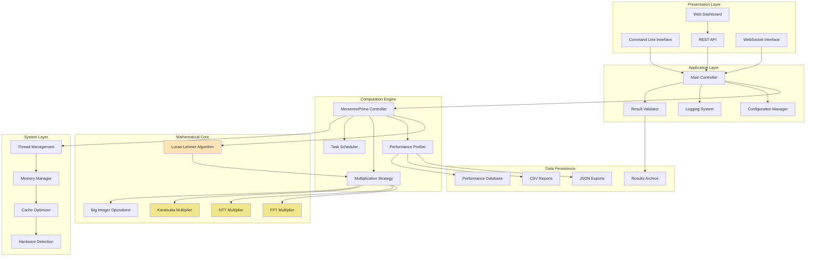

## Component Architecture

### Core Computation Engine

#### MersennePrime Class
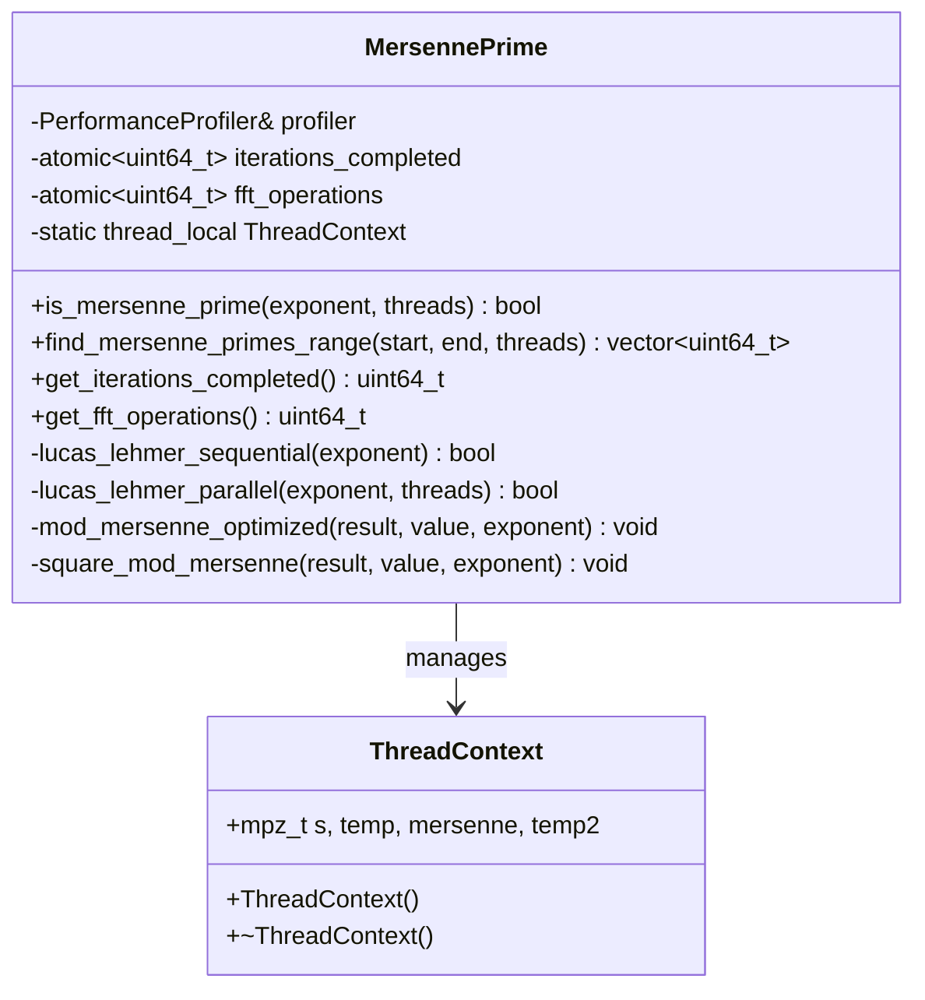

#### Multiplication Strategy Pattern
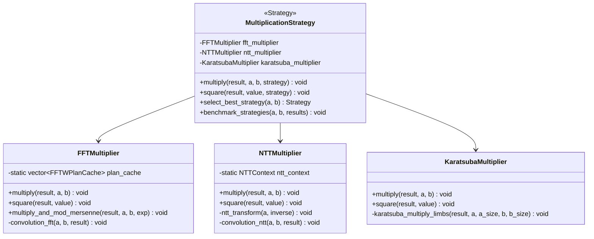

### Performance Profiling Architecture

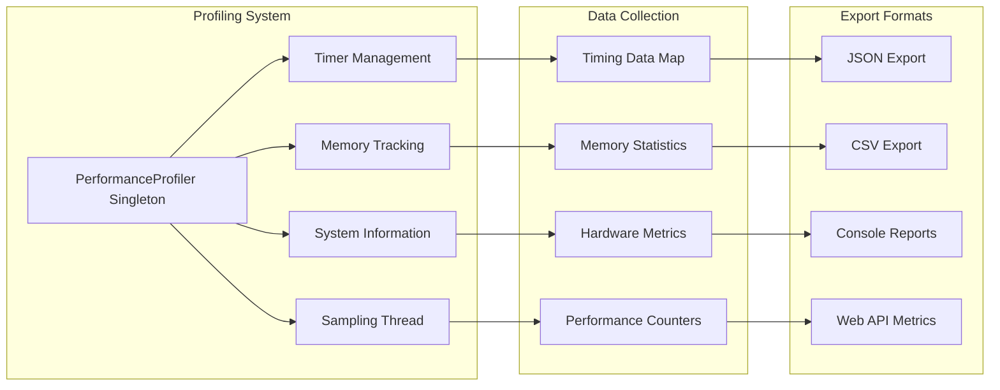

### Thread Management System

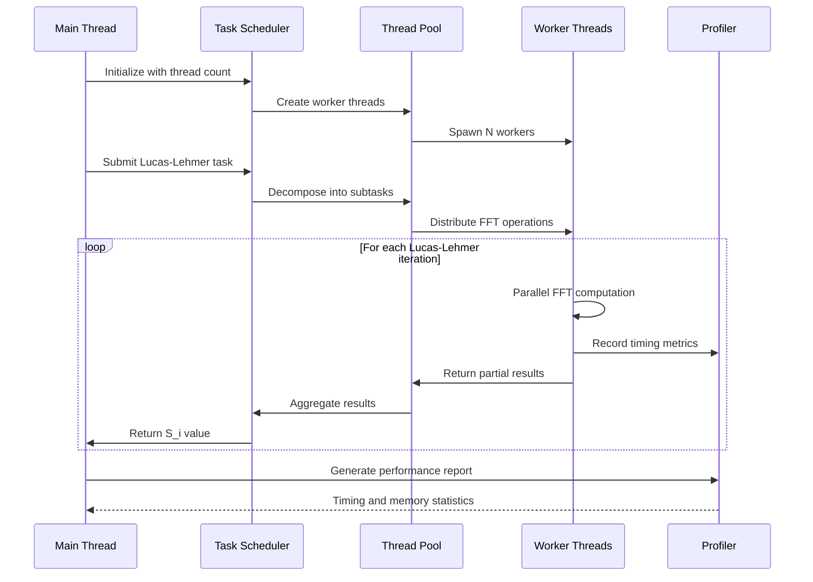

## Memory Management Architecture

### Memory Allocation Strategy

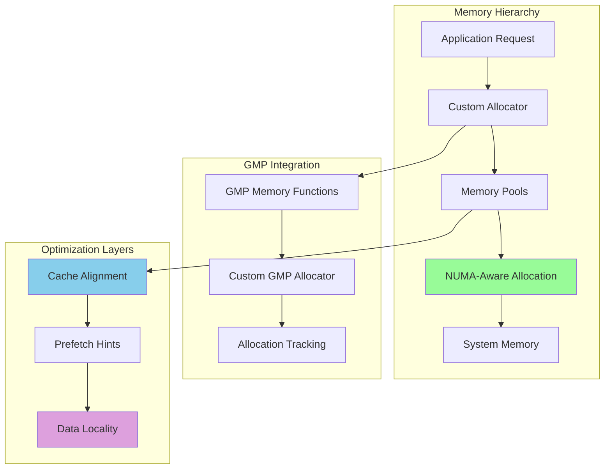

### Cache Optimization

The system implements multiple levels of cache optimization:

1. **L1 Cache Optimization**
   - Data structure alignment to cache line boundaries
   - Loop tiling for optimal cache utilization
   - Prefetch instructions for predictable access patterns

2. **L2/L3 Cache Management**
   - Blocking algorithms for large matrix operations (FFT)
   - Cache-aware data layouts
   - Minimization of cache conflicts

3. **Memory Bandwidth Optimization**
   - NUMA-aware thread scheduling
   - Streaming optimizations for large data sets
   - Vectorized memory operations

## Web Interface Architecture

### Frontend-Backend Communication

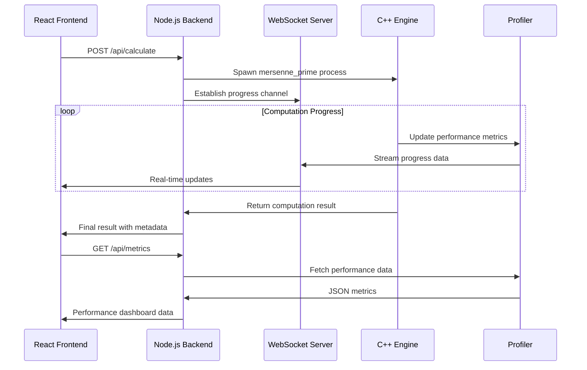

### API Design Patterns

```mermaid
graph TB
    subgraph "REST API Endpoints"
        CALC[/api/calculate/:exponent]
        BATCH[/api/batch]
        STATUS[/api/status/:taskId]
        METRICS[/api/metrics]
        HEALTH[/health]
    end
    
    subgraph "WebSocket Channels"
        PROGRESS[/ws - Progress Updates]
        LOGS[/ws - Log Stream]
        METRICS_WS[/ws - Real-time Metrics]
    end
    
    subgraph "Data Validation"
        INPUT[Input Sanitization]
        LIMITS[Resource Limits]
        AUTH[Authentication]
    end
    
    CALC --> INPUT
    BATCH --> LIMITS
    STATUS --> AUTH
    
    PROGRESS --> CALC
    LOGS --> BATCH
    METRICS_WS --> METRICS
    
    style CALC fill:#FFB6C1
    style PROGRESS fill:#98FB98
    style INPUT fill:#F0E68C
```

## Scalability Considerations

### Horizontal Scaling

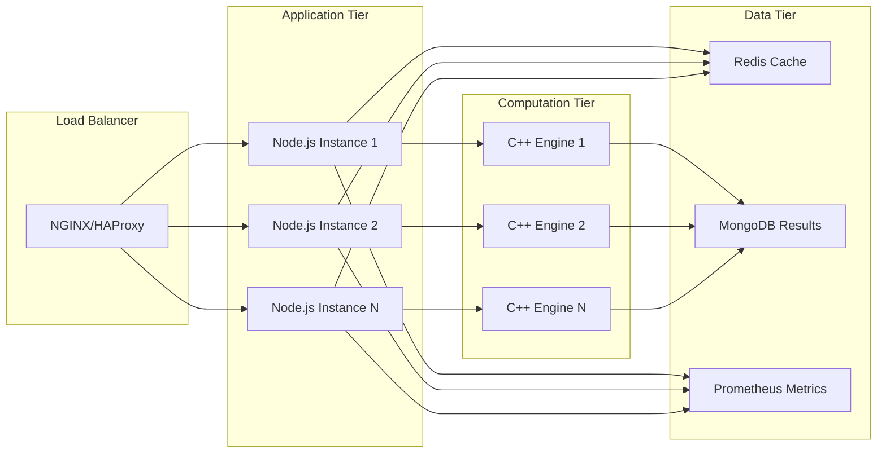

### Vertical Scaling Optimizations

1. **CPU Scaling**
   - Automatic thread count detection
   - NUMA topology awareness
   - CPU affinity optimization

2. **Memory Scaling**
   - Streaming algorithms for memory-constrained environments
   - Disk-based intermediate storage for very large computations
   - Memory-mapped file support

3. **I/O Scaling**
   - Asynchronous result persistence
   - Batch processing capabilities
   - Compressed data formats

## Security Architecture

### Input Validation and Sanitization

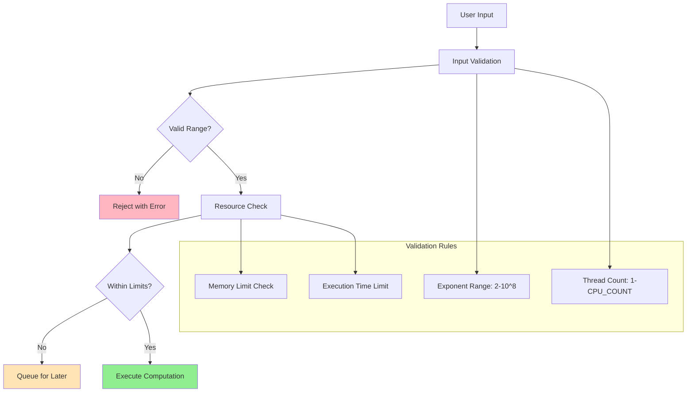

### Process Isolation

- Each computation runs in a separate process
- Resource limits enforced via cgroups (Linux)
- Sandboxing for untrusted computations
- Memory and CPU usage monitoring

## Performance Monitoring

### Real-time Metrics Collection

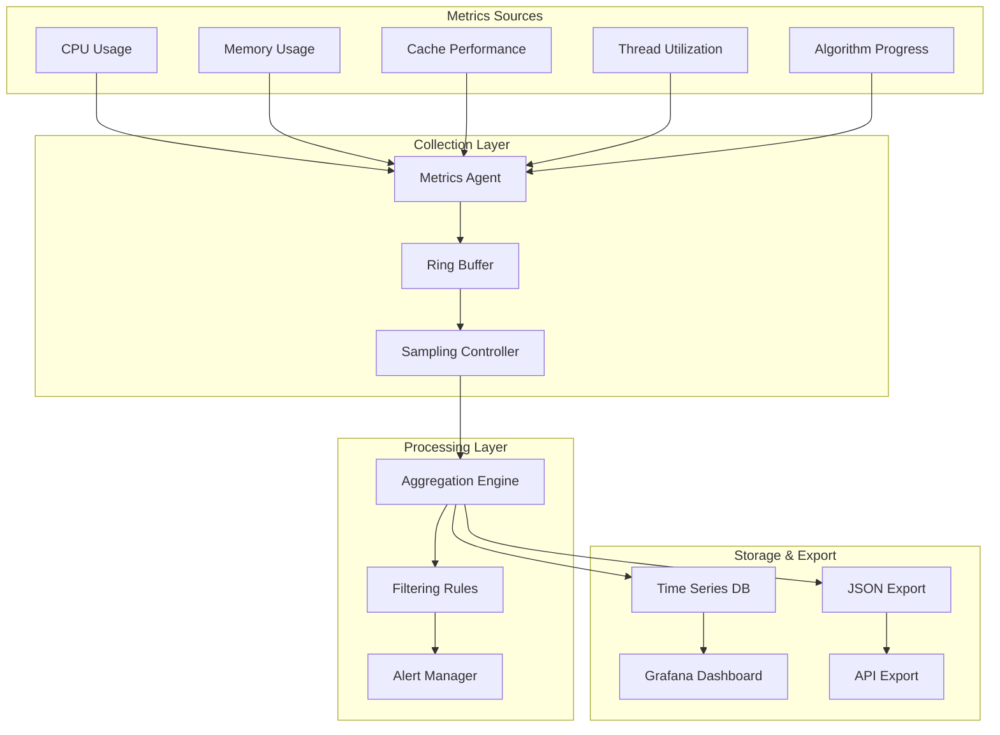

## Quality Assurance Architecture

### Testing Strategy

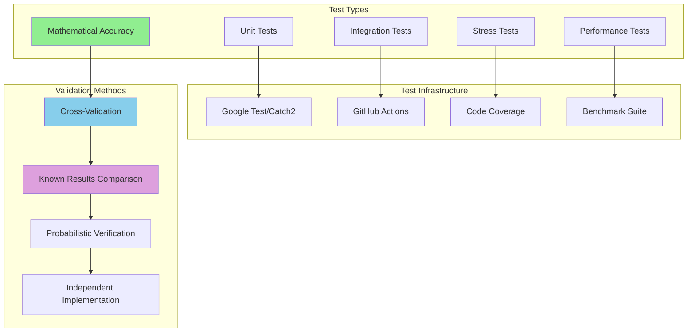

## Deployment Architecture

### Container Strategy

```mermaid
graph TB
    subgraph "Base Images"
        UBUNTU[Ubuntu 20.04 LTS]
        DEPS[Dependencies Layer]
        BUILD[Build Tools Layer]
    end
    
    subgraph "Application Layers"
        CPP_BUILD[C++ Build Layer]
        NODE_BUILD[Node.js Build Layer]
        STATIC[Static Assets Layer]
    end
    
    subgraph "Runtime Containers"
        CPP_RT[C++ Runtime]
        NODE_RT[Node.js Runtime]
        NGINX_RT[NGINX Proxy]
    end
    
    subgraph "Orchestration"
        COMPOSE[Docker Compose]
        K8S[Kubernetes (Optional)]
        MONITORING[Monitoring Stack]
    end
    
    UBUNTU --> DEPS
    DEPS --> BUILD
    BUILD --> CPP_BUILD
    BUILD --> NODE_BUILD
    BUILD --> STATIC
    
    CPP_BUILD --> CPP_RT
    NODE_BUILD --> NODE_RT
    STATIC --> NGINX_RT
    
    CPP_RT --> COMPOSE
    NODE_RT --> COMPOSE
    NGINX_RT --> COMPOSE
    COMPOSE --> K8S
    K8S --> MONITORING
    
    style CPP_RT fill:#98FB98
    style NODE_RT fill:#87CEEB
    style NGINX_RT fill:#DDA0DD
```

## Conclusion

This architecture provides a robust foundation for research-grade Mersenne prime computation with:

- **High Performance**: Optimized mathematical algorithms with parallel execution
- **Scalability**: Horizontal and vertical scaling capabilities
- **Maintainability**: Clean separation of concerns and modular design
- **Research Integration**: Comprehensive instrumentation and validation
- **Production Ready**: Security, monitoring, and deployment considerations

The modular design allows for independent optimization and enhancement of each component while maintaining system cohesion and performance characteristics suitable for academic research and large-scale computational mathematics.

---

*This architecture documentation provides the technical foundation for understanding and extending the Mersenne Hunter computational platform.*